# 🛡️ SentinelIMS — Incident Management System

A **high-throughput signal ingestion and incident management platform** with real-time dashboards, automated debouncing, strategy-pattern alerting, state machine work items, and mandatory RCA enforcement.

Built to handle **10,000+ signals/sec** with backpressure, deduplication, and zero data loss.

---

## Table of Contents

- [System Overview](#system-overview)
- [How It Works — End to End](#how-it-works--end-to-end)
- [Signal Ingestion Pipeline](#signal-ingestion-pipeline)
- [Backpressure & Ring Buffer](#backpressure--ring-buffer)
- [Debounce Engine](#debounce-engine)
- [Alert Strategy Pattern](#alert-strategy-pattern)
- [Incident State Machine](#incident-state-machine)
- [RCA Enforcement](#rca-enforcement)
- [Real-Time Dashboard](#real-time-dashboard)
- [Metrics Collection](#metrics-collection)
- [Database Schema](#database-schema)
- [Tech Stack](#tech-stack)
- [API Reference](#api-reference)
- [Project Structure](#project-structure)
- [Quick Start](#quick-start)
- [Running Tests](#running-tests)
- [Simulation Script](#simulation-script)

---

## System Overview

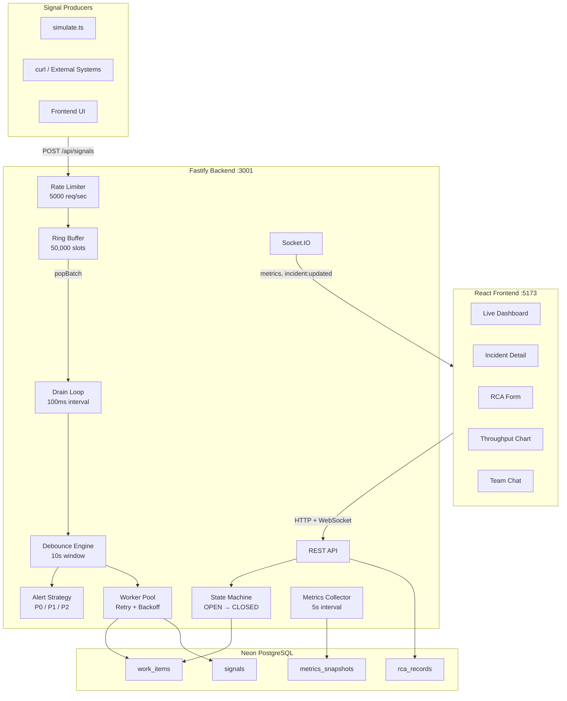

---

## How It Works — End to End

This flowchart shows the **complete lifecycle** of a signal from ingestion to incident closure:

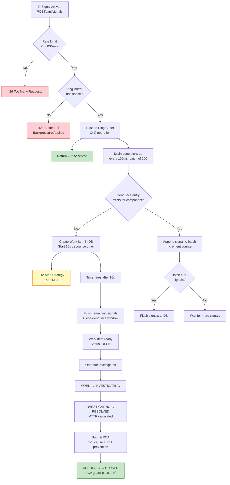

---

## Signal Ingestion Pipeline

The ingestion pipeline is designed for **maximum throughput** with complete decoupling between the fast HTTP path and the slower database persistence path.

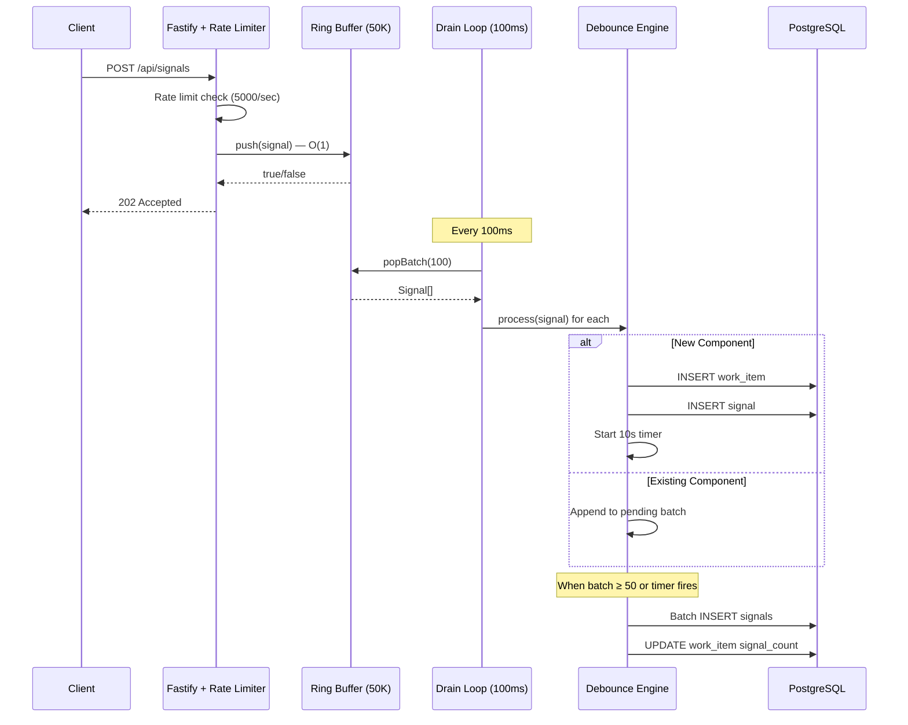

### Key Design Decisions

| Decision | Rationale |
|----------|-----------|
| **202 Accepted** (not 200 OK) | Signal is buffered, not yet persisted — honest HTTP semantics |
| **Ring Buffer** over queue | O(1) push/pop, fixed memory, no GC pressure |
| **100ms drain interval** | Balances latency vs. throughput — 1000 signals/sec sustained |
| **Fire-and-forget processing** | Drain loop doesn't await DB writes — keeps the loop fast |

---

## Backpressure & Ring Buffer

The Ring Buffer is a **fixed-size circular buffer** (50,000 slots) that provides backpressure when the database can't keep up with ingestion.

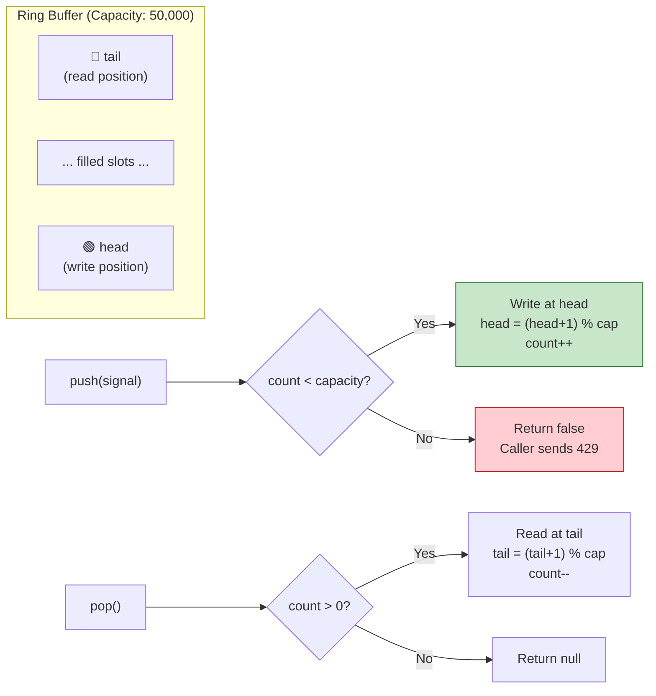

**How it prevents crashes:**
- If signals arrive at 10,000/sec but DB can only write 1,000/sec, the buffer absorbs the burst
- When the buffer fills, new signals get a `429` response — the producer knows to back off
- The buffer never allocates more memory — zero risk of OOM

---

## Debounce Engine

The Debounce Engine **aggregates many signals into single Work Items** per component within a 10-second window.

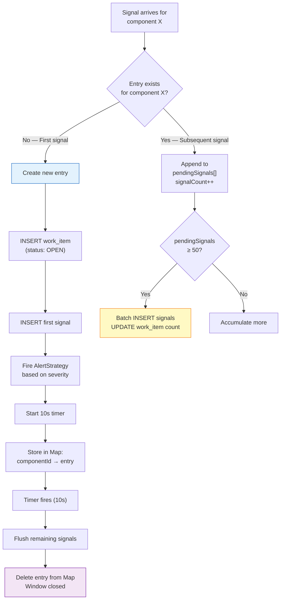

**Example:** 150 signals for `RDBMS_PRIMARY_01` in 8 seconds → **1 Work Item** with 150 linked signals.

The `(component_id, window_start)` unique constraint ensures **idempotency** — concurrent requests for the same component in the same window won't create duplicates.

---

## Alert Strategy Pattern

The system uses the **Strategy design pattern** to handle alerts differently based on severity. A factory selects the correct strategy from the component ID.

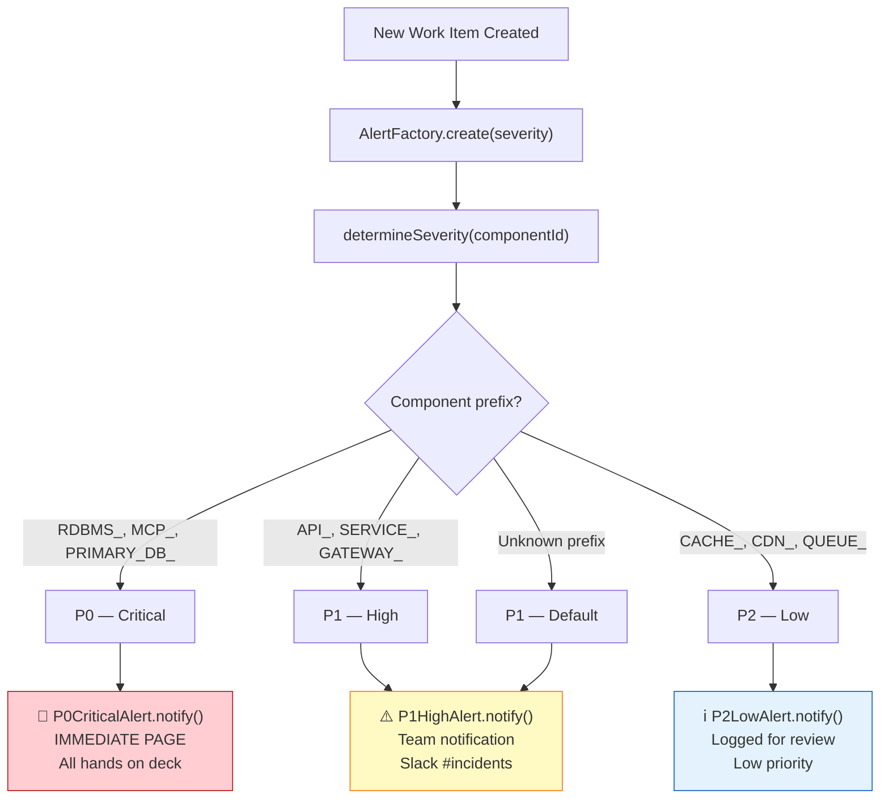

### Extending Alerts

To add a new alert channel (e.g., PagerDuty, Opsgenie), implement the `AlertStrategy` interface:

```typescript
interface AlertStrategy {
  readonly priority: string;
  notify(workItem: WorkItem): Promise<void>;
}
```

---

## Incident State Machine

Every Work Item follows a **strict state machine** with validated transitions and an RCA guard on closure.

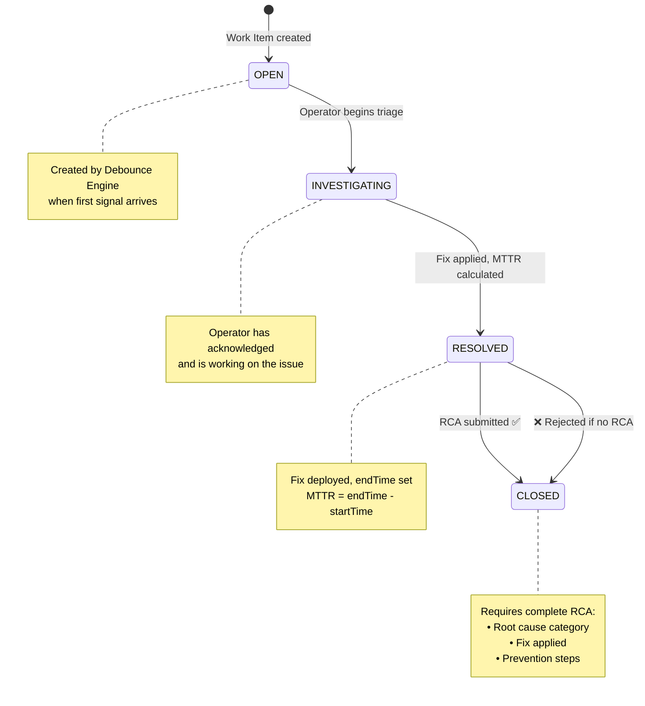

### Transition Validation

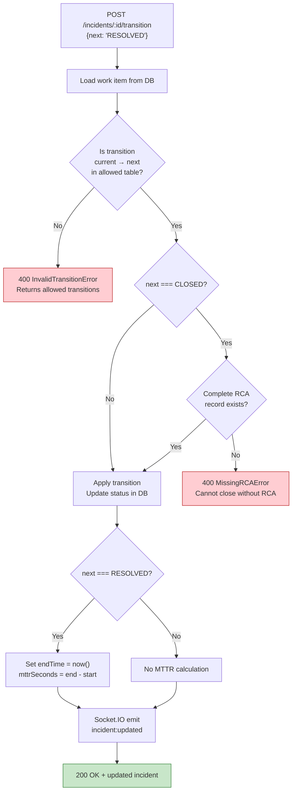

---

## RCA Enforcement

The system **mandates Root Cause Analysis** before any incident can be closed. This ensures organizational learning from every incident.

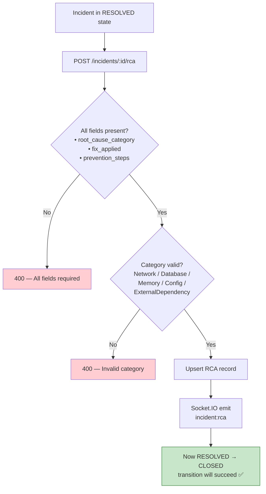

---

## Real-Time Dashboard

The frontend combines **HTTP polling + Socket.IO** for a responsive real-time experience.

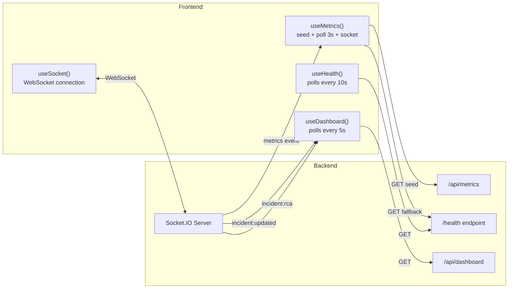

### Frontend Views

| View | Description |
|------|-------------|
| **Dashboard** | Live stats, signal ingestion chart, active incidents table, on-call roster, event log |
| **Incidents** | Paginated, sortable incident list with severity badges and status indicators |
| **Metrics** | System metrics cards + throughput-over-time area chart |
| **Signals** | Raw signal feed table grouped by component |
| **Teams** | Team roster with real-time chat (simulated auto-replies) |
| **Incident Detail** | Signal timeline, state transition buttons, RCA form, MTTR display |

---

## Metrics Collection

The Metrics Collector runs a **5-second interval loop** that captures system throughput and pushes it to the frontend via Socket.IO and stores snapshots in PostgreSQL.

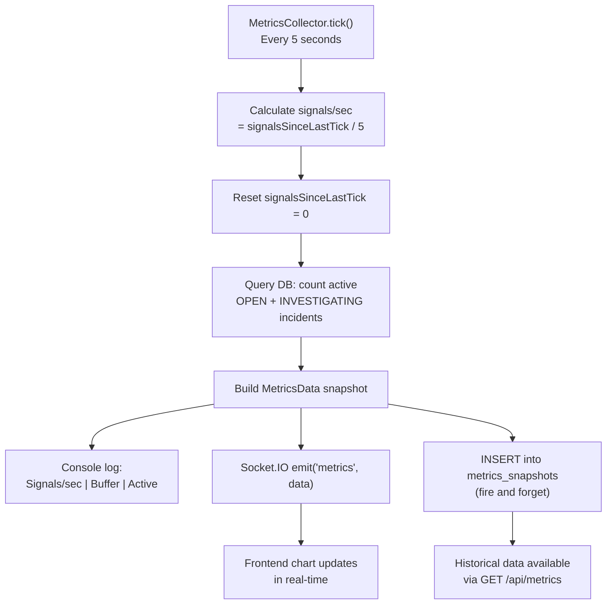

---

## Database Schema

Four tables in **Neon PostgreSQL** managed by **Drizzle ORM**:

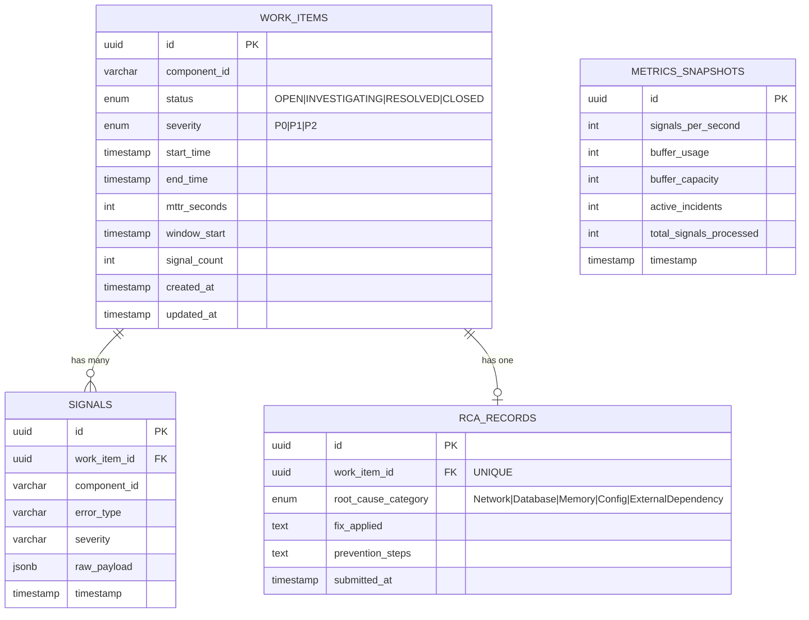

### Indexes

| Index | Table | Purpose |
|-------|-------|---------|
| `uq_component_window` | work_items | Unique constraint for debounce idempotency |
| `idx_work_items_status` | work_items | Fast status filtering |
| `idx_work_items_severity` | work_items | Fast severity filtering |
| `idx_signals_work_item_ts` | signals | Fast signal timeline queries |
| `idx_metrics_ts` | metrics_snapshots | Fast time-series queries |

---

## Tech Stack

| Layer | Technology | Justification |
|-------|-----------|---------------|
| Runtime | Node.js 20+ | Async-first, high throughput |
| Backend | Fastify 5 (TypeScript) | 2-3x faster than Express, built-in validation |
| ORM | Drizzle ORM | Type-safe, lightweight, great Neon support |
| Database | Neon PostgreSQL | Cloud-hosted serverless Postgres |
| Real-time | Socket.IO | Reliable WebSocket abstraction |
| Rate Limiting | @fastify/rate-limit | Built for Fastify, zero config |
| Frontend | React 19 + Vite 8 | Fast dev server, optimized builds |
| UI Library | shadcn/ui + Radix | Beautiful, accessible, customizable |
| Styling | TailwindCSS v4 | Utility-first CSS with Vite plugin |
| Charts | Recharts | React-native charting for dashboards |
| Testing | Vitest | Fast, Vite-native, TypeScript-first |

---

## API Reference

| Method | Endpoint | Description | Response |
|--------|----------|-------------|----------|
| `POST` | `/api/signals` | Ingest single signal | `202` Accepted / `429` Buffer full |
| `POST` | `/api/signals/batch` | Batch ingest (up to 500) | `202` / `207` Partial |
| `GET` | `/api/dashboard` | Live feed summary with counts | Dashboard data |
| `GET` | `/api/incidents` | Paginated incident list | Incidents + pagination |
| `GET` | `/api/incidents/:id` | Incident detail + signals + RCA | Full incident data |
| `POST` | `/api/incidents/:id/transition` | State change | Updated incident |
| `POST` | `/api/incidents/:id/rca` | Submit RCA | RCA record |
| `GET` | `/api/metrics` | Throughput history snapshots | Metrics array |
| `GET` | `/api/buffer/status` | Ring buffer usage stats | Buffer data |
| `GET` | `/health` | System health + DB latency | Health data |

### Signal Payload

```json
{
  "component_id": "RDBMS_PRIMARY_01",
  "error_type": "ConnectionTimeout",
  "severity": "critical",
  "metadata": { "latency_ms": 5200 }
}
```

### RCA Payload

```json
{
  "root_cause_category": "Database",
  "fix_applied": "Increased connection pool size from 10 to 50",
  "prevention_steps": "Add pool monitoring alerts at 80% utilization"
}
```

---

## Project Structure

```
SentinelIMS/
├── backend/
│   ├── src/
│   │   ├── buffer/
│   │   │   └── RingBuffer.ts        # Fixed-size circular buffer (backpressure)
│   │   ├── debounce/
│   │   │   └── DebounceEngine.ts     # Signal → Work Item aggregation (10s window)
│   │   ├── ingestion/
│   │   │   └── drainLoop.ts          # Background loop: buffer → debounce (100ms)
│   │   ├── metrics/
│   │   │   └── MetricsCollector.ts   # Throughput tracking + Socket.IO push (5s)
│   │   ├── routes/
│   │   │   ├── ingestion.ts          # POST /api/signals, /api/signals/batch
│   │   │   ├── incidents.ts          # CRUD, transitions, RCA, dashboard, metrics
│   │   │   └── health.ts             # GET /health
│   │   ├── state/
│   │   │   └── StateMachine.ts       # Transition validation + MTTR + RCA guard
│   │   ├── strategies/
│   │   │   └── AlertStrategy.ts      # Strategy pattern: P0/P1/P2 + Factory
│   │   ├── workers/
│   │   │   └── WorkerPool.ts         # Concurrency control + exponential backoff
│   │   ├── db/
│   │   │   ├── schema.ts             # Drizzle ORM table definitions
│   │   │   └── index.ts              # Neon connection
│   │   └── server.ts                 # Main entry: wires everything together
│   ├── tests/
│   │   ├── ringBuffer.test.ts        # Buffer push/pop/overflow tests
│   │   └── stateMachine.test.ts      # Transition validation + RCA guard tests
│   ├── drizzle.config.ts
│   └── package.json
├── frontend/
│   ├── src/
│   │   ├── components/
│   │   │   ├── Dashboard.tsx         # Main dashboard with all sub-views
│   │   │   ├── IncidentDetail.tsx    # Detail view with signals + RCA form
│   │   │   └── ui/                   # shadcn/ui components
│   │   ├── hooks/
│   │   │   └── useSocket.ts          # Socket.IO + dashboard + health + metrics hooks
│   │   ├── lib/
│   │   │   ├── api.ts                # HTTP client for all endpoints
│   │   │   └── utils.ts              # Formatting helpers
│   │   ├── App.tsx                   # App shell with sidebar navigation
│   │   ├── main.tsx                  # React entry point
│   │   └── index.css                 # Design system tokens + neumorphic styles
│   ├── vite.config.ts                # Vite + proxy to backend
│   └── package.json
├── scripts/
│   └── simulate.ts                   # End-to-end demo simulation
└── README.md
```

---

## Quick Start

### Prerequisites

- **Node.js 20+** and **npm**
- A **Neon PostgreSQL** database (or any Postgres with connection string)

### Setup

```bash
# Clone the repository
git clone <repo-url>
cd SentinelIMS

# ─── Backend ───────────────────────────────
cd backend
npm install

# Create .env with your database URL
echo "DATABASE_URL=postgresql://..." > .env

# Push schema to database
npx drizzle-kit push

# Start backend (port 3001)
npm run dev

# ─── Frontend (new terminal) ──────────────
cd frontend
npm install

# Start frontend (port 5173)
npm run dev
```

Open **http://localhost:5173** in your browser.

### Environment Variables

| Variable | Default | Description |
|----------|---------|-------------|
| `DATABASE_URL` | — | Neon PostgreSQL connection string (required) |
| `PORT` | `3001` | Backend server port |
| `HOST` | `0.0.0.0` | Backend bind address |
| `BUFFER_CAPACITY` | `50000` | Ring buffer size |
| `DRAIN_INTERVAL_MS` | `100` | Drain loop tick interval |
| `DEBOUNCE_WINDOW_MS` | `10000` | Debounce aggregation window |
| `RATE_LIMIT_MAX` | `5000` | Max requests per second per IP |

---

## Running Tests

```bash
cd backend
npm test          # Run all tests once
npm run test:watch  # Watch mode
```

Tests cover:
- **RingBuffer:** push, pop, batch pop, overflow behavior, capacity tracking
- **StateMachine:** valid transitions, invalid transitions, RCA guard enforcement, MTTR calculation

---

## Simulation Script

The simulation script demonstrates the **full incident lifecycle** end-to-end:

```bash
# From project root (backend must be running)
npx tsx scripts/simulate.ts
```

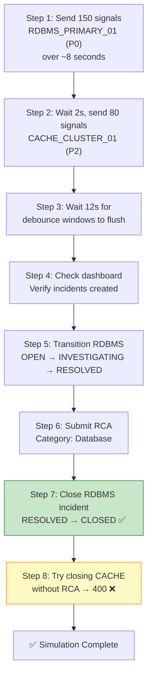

### Expected Output

```
📡 Step 1: Sending 150 signals for RDBMS_PRIMARY_01 (P0)...
  ✅ 150 signals sent

📡 Step 2: Sending 80 signals for CACHE_CLUSTER_01 (P2)...
  ✅ 80 signals sent

📊 Step 3: Dashboard shows 2 new incidents

🔄 Step 4: OPEN → INVESTIGATING ✅ → RESOLVED ✅

📝 Step 5: RCA submitted ✅

🔒 Step 6: RESOLVED → CLOSED ✅ (has RCA)

🧪 Step 7: Close without RCA → ✅ Correctly rejected (400)
```

---

## Worker Pool & Retry Logic

The Worker Pool wraps every database write with **exponential backoff retry** to handle transient failures:

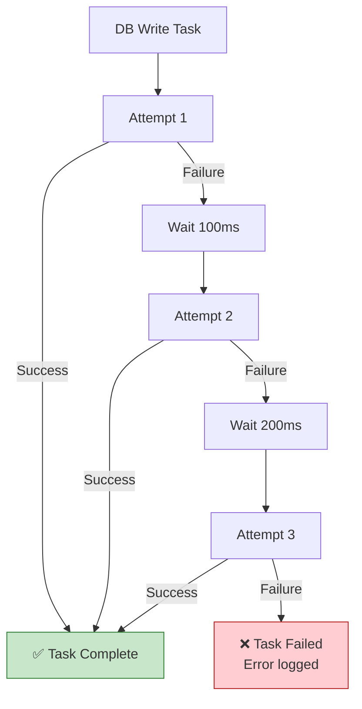

- **Max concurrency:** 10 simultaneous DB operations
- **Retry delays:** 100ms → 200ms → 400ms (exponential)
- **Queue:** Excess tasks wait until a slot opens

---

## License

MIT
